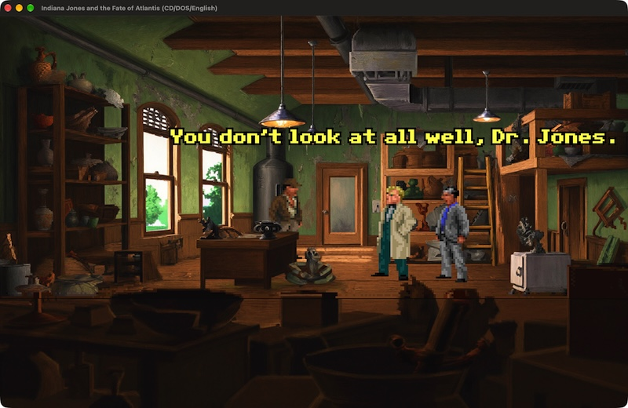

# atlantis-hd-bundle

HD backgrounds for *Indiana Jones and the Fate of Atlantis* (LucasArts, 1992),
for personal use. There are three projects, run in this order:

| Folder | What it does | Output |
|---|---|---|
| [`atlantis-textures-exporter/`](atlantis-textures-exporter/) | Extracts the 96 room backgrounds from your own copy of the game (`ATLANTIS.001`, SCUMM v5) | `out/`: indexed PNGs at native size, with the exact palette, plus `manifest.json` |
| [`atlantis-texture-enhancement/`](atlantis-texture-enhancement/) | Repaints each room at exactly 4x through ComfyUI, then checks it with a geometry gate and a VLM review | `data/rooms-ai/`: 4x RGB PNGs, pixel-aligned with the source |
| [`atlantis-textures-importer/`](atlantis-textures-importer/) | Builds a patched ScummVM that shows the 4x backgrounds, and installs it with them into the GOG app (with a backup and `make importer-hd-uninstall`) | the GOG app, playing in 1280x800 |

The root `Makefile` drives all three: `make exporter-extract`,
`make enhancer-caption` / `enhancer-batch` / `enhancer-review` / `enhancer-verify`,
and `make importer-engine-build` / `importer-hd-install` / `importer-hd-verify`;
`make help` lists every target. The enhancement kit reads
`../atlantis-textures-exporter/out` by default; set `ATL_SRC` to point it
elsewhere. Each folder has its own README and virtualenv.

Neither project commits game data or generated art: `out/`, `data/` and
`reviews.yaml` are gitignored. You need your own copy of the game.

## License

[MIT](LICENSE)
